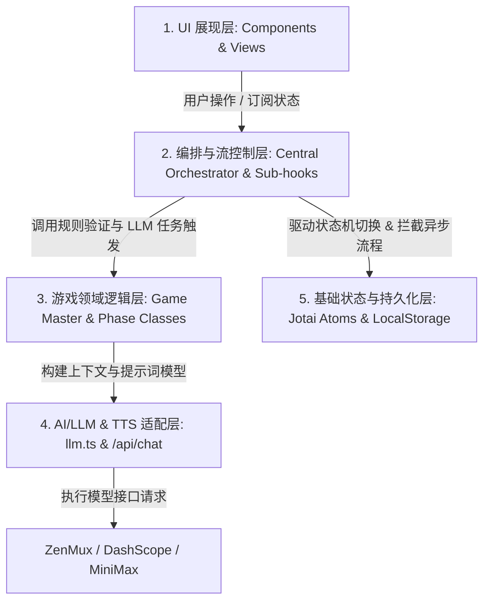
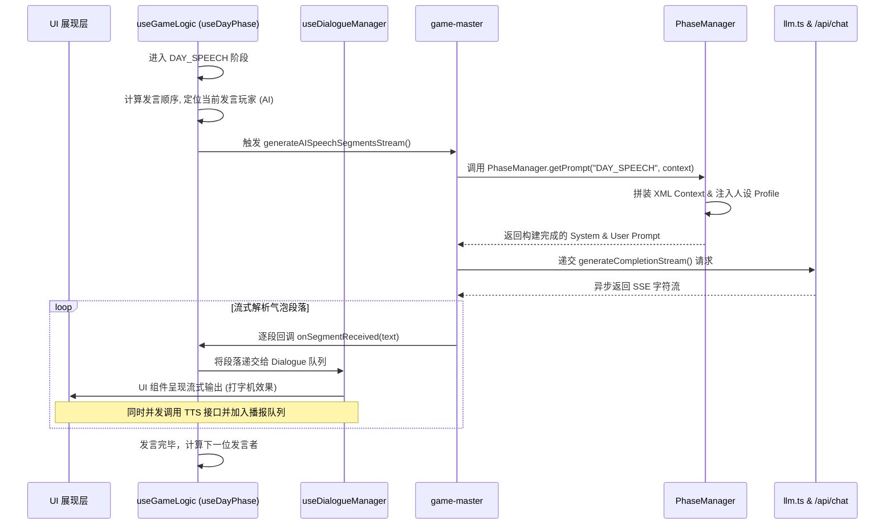

# Wolfcha 游戏系统架构 - 总览原理文档

本项目是一套基于 Next.js 16 App Router、React 及 LLM 驱动的高性能社交推理游戏（狼人杀）引擎。整个系统完全摒弃了传统的多端联机服务器，转而采用客户端运行“游戏主控（Game Master）”与“AI 代理群（Agent Group）”的架构。每一位非人类玩家都配置了独特的 LLM 决策引擎，模拟出复杂的心理、推理偏好与对话表现。

---

## 一、 系统核心分层设计

Wolfcha 的整体架构可以划分为五个核心层次。这种分层确保了 UI 展现层、异步业务调度层、游戏领域逻辑层、大语言模型适配层以及基础状态管理层之间的低耦合和高内聚。

### 1.1 UI 展现层 (UI & Interaction Layer)
*   **职责**：负责游戏主界面、座位图布局、对话气泡流式呈现、旁白特效展示、控制面板菜单。
*   **特性**：
    *   通过自定义打字机组件实现 AI 发言与 TTS 语音播放的高步调协同。
    *   不直接触碰游戏引擎逻辑，完全依靠订阅全局 Jotai 状态进行响应式重绘。

### 1.2 编排与流控制层 (Central Orchestrator & Flow Control)
*   **职责**：编排完整的狼人杀生命周期，包括白天与黑夜更替、警长竞选、处决投票、平票 PK、特殊角色（猎人、白狼王）技能触发等极其复杂的异步事务。
*   **机制**：由于每个 AI 玩家决策与发言都是耗时较长的异步 LLM 交互，此层引入了 `AsyncFlowController` 机制，提供强健的“FlowToken（流程令牌）”保护，有效解决网络延迟、用户中断或重置游戏等并发竞态问题。

### 1.3 游戏领域逻辑层 (Game Domain Logic)
*   **职责**：狼人杀核心规则的裁判者。具体包括：
    *   游戏玩家数据初始化、随机发牌；
    *   纯规则校验（如“守卫不能连守”、“女巫双药各一次限额”、“奶守同守暴毙判定”）；
    *   游戏胜负判定（好人阵营清空狼人，或狼人数量达到或超过存活好人数）；
    *   阶段提示词编排：`PhaseManager` 负责将当前的 `Phase` 状态分发给对应的 `GamePhase` 派生类。

### 1.4 AI/LLM & TTS 适配层 (AI Engine & Multimedia Adapter)
*   **职责**：负责全包揽的模型请求抽象与多模态输出。
    *   将底层流式/非流式 API 统一为 `generateCompletionStream` 和 `generateJSON` 接口；
    *   实现模型调用的指数退避重试（针对 429、50x 错误）以及完备的 JSON 容错纠错解析；
    *   多模态对接，负责调用 MiniMax 接口合成流式 TTS 并注入音频播放队列中顺序执行。

### 1.5 基础状态与持久化层 (State & Persistence Layer)
*   **职责**：全局状态原子化管理。
    *   使用全局 `gameStateAtom` 作为唯一的“单一可信数据源（Single Source of Truth）”；
    *   与 LocalStorage 绑定，设定 24 小时 TTL 时效保护，实现页面刷新时游戏进度的无缝原地恢复。

---

## 二、 核心数据流与时序

在 Wolfcha 的游戏循环中，核心逻辑的推进是由“编排层”发起、通过“领域逻辑层”做状态演算和 LLM 调用，再同步写入“状态管理层”，最终拉动“UI 展现层”刷新的单向数据流。

以下是白天气泡发言环节的一套典型异步调用时序：

---

## 三、 数据一致性与竞态保障原理

因为 LLM 生成与 TTS 语音播报均是高延时的异步操作，如何保证游戏控制逻辑与用户主动操作（如用户在 AI 发言未结束时点击“跳过”、“再来一局”或“重置游戏”）之间的一致性至关重要：

1.  **令牌判定 (FlowToken Validation)**：
    *   每一次需要推进状态或产生 LLM 决策的异步操作前，系统会捕获当前的 `gameId` 和 `phase` 状态标识为一个 Token；
    *   在任何 `await` 异步回调返回之后，**必须首先通过 `token.isValid()` 校验**。若用户在此期间重置了游戏或转移了阶段，Token 就会在运行时失效，系统立刻丢弃该异步分支的全部遗存结果，阻止脏数据回写 gameState。
2.  **状态防抖与原子重置**：
    *   对 `gameStateAtom` 进行写入时，必须基于函数式 updater。所有的修改都是只读拷贝后回写，避免脏引用导致的副作用并发执行。

---

## 四、 扩展指南

若需要向游戏中增加新的角色或调整局势规则，请务必遵守以下模块拓展路径：
1.  **定义阶段枚举**：在 `src/types/game.ts` 的 `Phase` 联合类型中注册新的子阶段；
2.  **实现 Prompt 派生**：在 `src/game/phases/` 目录中创建或扩充继承自 `GamePhase` 的决策类，提供特定角色视角提示词；
3.  **编排逻辑挂载**：在 `src/hooks/game-phases/` 中或者主编排器中寻找流程衔接点，利用 FlowToken 封装异步 LLM 调用；
4.  **行号维护规定**：若对函数位置、流程定义做了物理移动或行数修改，**必须同步更新本目录下的各分模块实现文档中的行号指针**，以保障系统研发文档的持续可靠。
