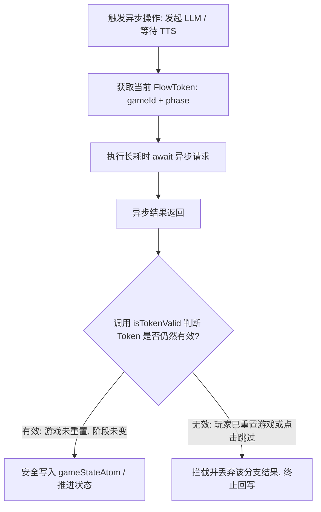

# 模块 02 - 状态管理与异步流程控制 - 原理文档

在 Wolfcha 这种包含高频 AI 交互、长轮询异步延时以及多模态流式输出的游戏中，状态一致性与异步流控制是整个系统的基石。本项目通过结合 Jotai 状态原子与自定义的 FlowToken 流程拦截机制，构建了一套高鲁棒性的客户端单向状态推进系统。

---

## 一、 Jotai 状态原子架构 (Atomic State Architecture)

Wolfcha 放弃了复杂的 Redux 或 Context 树，采用 **Jotai** 进行细粒度的响应式状态管理。

### 1.1 核心状态单一可信源 (`gameStateAtom`)
整个游戏的全部数据（包括游戏天数、玩家列表、死亡快照、投票分布、角色技能使用状态等）都收纳在单个大对象 `GameState` 中，由 `gameStateAtom` 统一存取。其设计遵循以下原则：
*   **单一可信源 (Single Source of Truth)**：任何组件对游戏状态的订阅和修改均必须指向该原子，消除数据不一致的死锁。
*   **数据模型不可变性 (Immutability)**：在每一次状态变更时，都通过浅拷贝或展开运算符重构状态树，保证 React 的 `useMemo` 和响应式依赖能够准确感知触发更新。

### 1.2 24小时时效缓存机制 (LocalStorage & TTL)
由于单局狼人杀游戏往往需要十几分钟乃至数十分钟的深度对抗，系统集成了持久化缓存功能：
*   **原地刷新恢复 (Hot-Reload Resilience)**：每次 `gameStateAtom` 发生写入时，引擎都会自动将其以特定 Key 序列化到 `localStorage` 中。当用户误触刷新网页，初始化时会首先读取该缓存，实现无缝局进度恢复。
*   **TTL (Time To Live) 淘汰机制**：为防止过期的游戏历史无限期堆积占用浏览器存储，系统为 LocalStorage 中的游戏缓存写入了戳记。在加载时若判定存储时间已超过 24 小时，则会自动失效并重置，防止脏数据影响新开局。

---

## 二、 异步流程防竞态原理 (FlowToken Pattern)

由于游戏中每一个 AI 玩家决策、发言和 TTS 语音合成均涉及长时间的异步 HTTP 请求及队列等待，多线程竞态（Race Condition）是发生逻辑崩坏的元凶。

```
[场景描述]：AI 玩家在 DAY_SPEECH 阶段正在异步生成其发言（耗时约 5 秒）。在第 2 秒时，人类玩家因感到冗长，强行点击了“重置游戏”或“跳过发言”。
[竞态问题]：若无任何拦截机制，第 5 秒时 LLM 请求返回，过期的异步回调仍会尝试将 AI 的发言文本回写进已经重置的全局游戏状态中，导致状态崩溃、逻辑错乱。
```

为了解决上述问题，Wolfcha 设计了 **FlowToken** 模式：



### 2.1 状态令牌 (FlowToken) 的构成
FlowToken 是一个包含游戏唯一性标识和状态切片的只读快照：
*   `gameId`: 当前局的 UUID。重置游戏时，会生成一个全新的 UUID，使上一局的所有 Token 物理失效。
*   `phase`: 产生该 Token 的游戏阶段。阶段转移后，针对旧阶段发起的异步写操作将直接被拒绝。

### 2.2 流程控制器 (AsyncFlowController)
`AsyncFlowController` 是一个位于 `lib/` 层面的纯状态类。它负责维护当前的活性令牌，并在异步边界处充当守门员角色。所有的 `useGameLogic` 操作在 `await` 返回后，均需强行插入 `token.isValid()` 检查。
