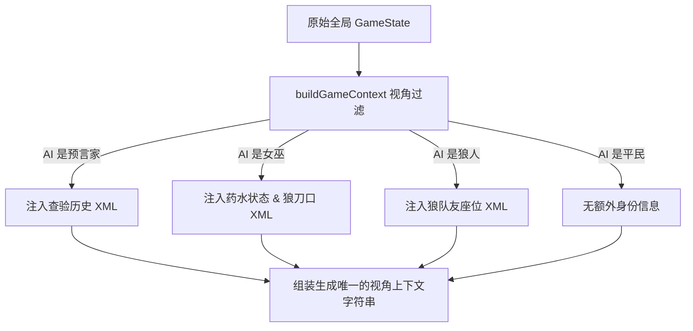

# 模块 04 - AI与提示词编排 - 原理文档

社交推理游戏的 AI 玩家面临的核心难题在于：如何使 AI 既拥有极佳的表达创意和拟真社交感，又在核心决策（如投票、用药）上具备严格的逻辑操守，并且能在控制上下文 Token 开销的同时维护长期推理记忆。Wolfcha 采用三阶段温度控制、双层缓存提示词（Prompt Caching）和多维视角上下文（Context Engine）来应对此项难题。

---

## 一、 双层提示词架构与Ephemeral缓存控制原理 (Prompt Architecture & Caching)

为了在频繁的 LLM 调用中大幅削减 Token 开销并缩短响应首包时间（TTFT），Wolfcha 设计了基于 **System Parts** 的动态双层提示词结构。

```
【System Prompt】（可缓存，结构占 80%）
 - Part 1: AI 玩家特定的 displayName, gender, age 基础信息与角色胜利条件。
 - Part 2: Persona (性格标签、表达规则、语气特色) 与 PlayerMind (逻辑深度、自保倾向、怀疑度)。
 - Part 3: 底线发言与推理指南（严禁职业术语，用 X 号称呼等）。
 => 系统在 System Parts 的末尾设置 `cache_control: { type: "ephemeral" }`。

【User Prompt】（动态区，结构占 20%）
 - 今日系统公告、当前存活列表、座位死亡史。
 - 今日讨论的发言记录历史。
 - 历史投票分布矩阵（YAML 结构）。
```

### 1.1 网关缓存控制原理 (Context Caching)
ZenMux 等支持 Anthropic Prompt Caching 协议的网关在识别到 `cache_control` 标记后，会将 System Prompt 部分驻留在服务端的临时内存中（通常 TTL 为 5-10 分钟）。
当同局内的 AI 玩家反复轮流发言时，高达数千 Token 的系统人设与发言守则无需每次都重新传输和计算，**节省了 70% 以上的 Input Token 费用**，并使发言响应时间由 4-5 秒骤降至 1 秒以内。

---

## 二、 动态视角上下文发生器原理 (`buildGameContext`)

AI 必须绝对遵循“信息不对称”的游戏核心规则。例如：狼人能看到队友是谁，而预言家只能看到自己的验人历史，平民则两眼一抹黑。

`buildGameContext` 充当了“视角隔离器（Perspective Filter）”的角色：



组装完成后的信息流包含以下核心数据结构：
1.  **YAML 格式状态矩阵**：包含当前天数、存活座位号、死因与死亡天数等，相较于自然语言，YAML 对大模型的结构化识别率高达 99%。
2.  **今日系统公告**：表明昨夜死亡情况或平安夜结论。
3.  **发言与投票轨迹列表**：精简记录历史上的所有人投人细节，作为 AI 进行“票路分析（Vote Path Analysis）”的数学依据。

---

## 三、 三阶段温度参数设计说明 (Temperature Engine)

为确保“该说话时生动，该决策时严谨”，系统设置了精细的温度控制矩阵（定义于 `src/lib/ai-config.ts`）：
1.  **极度混沌 (Temperature = 1.2)**：用于**角色生成**。追求极致的多样性、背景故事的随机创意，避免产生重复或套路化的人格设定。
2.  **高拟真创意 (Temperature = 1.1)**：用于**发言、遗言与 PK**。鼓励 AI 表现出语气词、停顿、情绪倾向、MBTI 话术，模拟真实玩家在桌面上的互动张力。
3.  **逻辑确定性 (Temperature = 0.4)**：用于**出刀、用药、查验、投票与自爆**。在此温度下，LLM 的幻觉被极大抑制，严格遵循“如果是预言家，优先查验高嫌疑对象”、“如果是女巫，不要毒杀金水（好人）”等强逻辑约束，保证游戏逻辑绝对不发生崩坏。
4.  **绝对客观记录 (Temperature = 0.1)**：用于**每日摘要生成**。必须以客观法官的视角压缩事实，不夹杂任何推断，低温度确保摘要结果极度稳定。
